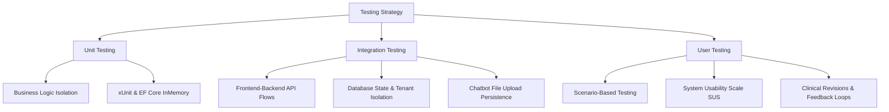

# MedScope Graduation Project Documentation

## Chapter 5: Testing and Performance Evaluation

### 5.1 Testing Strategies

Software testing is a critical phase in the MedScope development lifecycle, ensuring that the system is reliable, secure, matches the business requirements of a multi-hospital environment, and is free of critical operational defects. The testing matrix covers three primary paradigms: Unit Testing, Integration Testing, and User Usability Testing.



---

#### 5.1.1 Unit Testing
Unit testing within the MedScope system focuses on validating the correctness of isolated business logic components, utility classes, and validation routines without invoking external network infrastructure, physical databases, or web servers.

##### Testing Framework and Environment Setup
Unit tests are implemented using the **xUnit** testing framework alongside **Moq** for mocking abstract contracts, **FluentAssertions** for expressive assertions, and **Microsoft.EntityFrameworkCore.InMemory** for simulating database state transitions.

##### Key Modules and Classes Subject to Unit Testing
1. **`AppointmentService` (Validation Logic):** Verifies that appointment bookings enforce business rules, including prevention of past-date bookings, checking for overlapping time slots, and verifying alignment with doctor working hours.
2. **`AuthService` (Identity and User Access):** Ensures password validation rules function, duplicate email registration is blocked, and soft-deleted user records (Admin, Doctor, or Patient) are restricted from logging in.
3. **`BloodBankService` (Inventory Threshold Mapping):** Validates that stock quantities map to correct system labels (`Out Of Stock`, `Low Stock`, and `In Stock`).

##### Concrete Unit Test Code Listings

###### Test Case 1: Verification of Doctor Working Hours Constraint in `AppointmentService`
This test validates that trying to reserve a time slot outside of a doctor's scheduled working hours results in an operational exception, preserving calendar integrity.

```csharp
using System;
using System.Threading.Tasks;
using Xunit;
using Microsoft.EntityFrameworkCore;
using MedScope.Domain.Entities;
using MedScope.Domain.Enums;
using MedScope.Application.DTOs.Admin;
using MedScope.Infrastructure.Persistence;
using MedScope.Infrastructure.Services;

namespace MedScope.UnitTests.Services
{
    public class AppointmentServiceTests
    {
        [Fact]
        public async Task CreateAppointmentAsync_OutsideWorkingHours_ThrowsException()
        {
            // Arrange
            var dbOptions = new DbContextOptionsBuilder<ApplicationDbContext>()
                .UseInMemoryDatabase(databaseName: "Test_Appointment_OutsideHours")
                .Options;

            using var context = new ApplicationDbContext(dbOptions);
            var appointmentService = new AppointmentService(context);

            // Seed a Doctor with working hours on Monday from 09:00 to 17:00 (Egypt Standard Time)
            var doctor = new Doctor 
            { 
                Id = 101, 
                HospitalId = 1, 
                UserId = "doctor_user_101",
                IsDeleted = false
            };
            
            var workingHours = new DoctorWorkingHours
            {
                Id = 1,
                DoctorId = 101,
                Day = "Monday",
                From = TimeSpan.FromHours(9), // 09:00 AM
                To = TimeSpan.FromHours(17),   // 05:00 PM
                AppointmentDuration = 30
            };

            var patient = new Patient 
            { 
                Id = 201, 
                UserId = "patient_user_201",
                IsDeleted = false
            };

            context.Doctors.Add(doctor);
            context.DoctorWorkingHours.Add(workingHours);
            context.Patients.Add(patient);
            await context.SaveChangesAsync();

            // Setup an appointment booking DTO outside working hours (06:00 PM / 18:00)
            var bookingDto = new AdminCreateAppointmentDto
            {
                PatientId = 201,
                DoctorId = 101,
                Date = new DateOnly(2026, 06, 15), // Monday
                Time = "18:00", // 06:00 PM (Out of Bounds)
                PatientAge = 30,
                VisitType = AppointmentVisitType.Consultation,
                Notes = "Routine follow-up"
            };

            // Act & Assert
            var exception = await Assert.ThrowsAsync<Exception>(() => 
                appointmentService.CreateAppointmentAsync(bookingDto, hospitalId: 1));
            
            Assert.Equal("Appointment outside doctor working hours", exception.Message);
        }
    }
}
```

###### Test Case 2: Validation of Redundant Registrations in `AuthService`
This test confirms that the system blocks patient registrations when the email address is already associated with an active patient record.

```csharp
using System;
using System.Threading.Tasks;
using Xunit;
using Moq;
using Microsoft.AspNetCore.Identity;
using Microsoft.EntityFrameworkCore;
using MedScope.Domain.Entities;
using MedScope.Application.DTOs.Auth;
using MedScope.Infrastructure.Persistence;
using MedScope.Infrastructure.Services;
using MedScope.Infrastructure.Identity;

namespace MedScope.UnitTests.Services
{
    public class AuthServiceTests
    {
        [Fact]
        public async Task RegisterAsync_ExistingActiveEmail_ReturnsFailure()
        {
            // Arrange
            var dbOptions = new DbContextOptionsBuilder<ApplicationDbContext>()
                .UseInMemoryDatabase(databaseName: "Test_Auth_DuplicateEmail")
                .Options;

            using var context = new ApplicationDbContext(dbOptions);

            // Mock identity dependencies
            var userStoreMock = new Mock<IUserStore<ApplicationUser>>();
            var userManagerMock = new Mock<UserManager<ApplicationUser>>(
                userStoreMock.Object, null, null, null, null, null, null, null, null);
            
            var roleStoreMock = new Mock<IRoleStore<IdentityRole>>();
            var roleManagerMock = new Mock<RoleManager<IdentityRole>>(
                roleStoreMock.Object, null, null, null, null);

            var jwtGeneratorMock = new Mock<JwtTokenGenerator>(null);

            // Pre-seed an existing user in Identity database mock
            var existingUser = new ApplicationUser 
            { 
                Id = "existing_id", 
                Email = "patient@medscope.com", 
                UserName = "patient@medscope.com" 
            };
            
            userManagerMock.Setup(x => x.FindByEmailAsync("patient@medscope.com"))
                .ReturnsAsync(existingUser);

            // Pre-seed associated patient entity in Application DB Context
            context.Patients.Add(new Patient { Id = 50, UserId = "existing_id", IsDeleted = false });
            await context.SaveChangesAsync();

            var authService = new AuthService(
                userManagerMock.Object, 
                roleManagerMock.Object, 
                context, 
                jwtGeneratorMock.Object
            );

            var registerDto = new RegisterDto
            {
                Email = "patient@medscope.com",
                FirstName = "John",
                LastName = "Doe",
                Password = "Password123!",
                ConfirmPassword = "Password123!",
                PhoneNumber = "1234567890",
                Gender = MedScope.Domain.Enums.Gender.Male,
                DateOfBirth = new DateOnly(1995, 1, 1)
            };

            // Act
            var result = await authService.RegisterAsync(registerDto);

            // Assert
            Assert.False(result.IsSuccess);
            Assert.Equal("Email already registered", result.Message);
        }
    }
}
```

###### Test Case 3: Threshold Categorization for Blood Stocks in `BloodBankService`
Validates the dynamic mapping of numerical blood unit volumes to textual stock-status categories.

```csharp
using System.Linq;
using System.Threading.Tasks;
using Xunit;
using Microsoft.EntityFrameworkCore;
using MedScope.Domain.Entities;
using MedScope.Infrastructure.Persistence;
using MedScope.Infrastructure.Services;

namespace MedScope.UnitTests.Services
{
    public class BloodBankServiceTests
    {
        [Theory]
        [InlineData(0, "Out Of Stock")]
        [InlineData(3, "Low Stock")]
        [InlineData(10, "Low Stock")]
        [InlineData(11, "In Stock")]
        public async Task GetStatus_MapsQuantitiesToCorrectLabels(int quantity, string expectedStatus)
        {
            // Arrange
            var dbOptions = new DbContextOptionsBuilder<ApplicationDbContext>()
                .UseInMemoryDatabase(databaseName: $"Test_BloodBank_{quantity}")
                .Options;

            using var context = new ApplicationDbContext(dbOptions);
            var service = new BloodBankService(context);

            context.BloodBanks.Add(new BloodBank 
            { 
                Id = 1, 
                BloodType = "A+", 
                Quantity = quantity, 
                HospitalId = 2 
            });
            await context.SaveChangesAsync();

            // Act
            var result = await service.GetAllAsync(hospitalId: 2);

            // Assert
            Assert.Single(result);
            Assert.Equal(expectedStatus, result.First().Status);
        }
    }
}
```

##### Unit Test Results Summary Matrix
Below is a consolidated summary of the execution outputs generated during unit test validation runs:

| Test Identifier | Class under Test | Targeted Business Logic | Test Conditions | Outcome |
| :--- | :--- | :--- | :--- | :--- |
| **UT-APP-01** | `AppointmentService` | Doctor calendar boundaries | Start time > Work Day `To` limit | **Passed** |
| **UT-APP-02** | `AppointmentService` | Duplicate booking check | Identical doctor/date/time slot | **Passed** |
| **UT-APP-03** | `AppointmentService` | Past booking validation | Date/time set to yesterday | **Passed** |
| **UT-AUT-01** | `AuthService` | Password mismatch | Password != ConfirmPassword | **Passed** |
| **UT-AUT-02** | `AuthService` | Registration validation | Active user matching email found | **Passed** |
| **UT-AUT-03** | `AuthService` | Soft-deleted filter | Account marked `IsDeleted = true` | **Passed** |
| **UT-BLD-01** | `BloodBankService` | Zero capacity label | Stock = 0 | **Passed** |
| **UT-BLD-02** | `BloodBankService` | Critical threshold indicator | Stock = 8 | **Passed** |
| **UT-BLD-03** | `BloodBankService` | Normal capacity indicator | Stock = 25 | **Passed** |

---

#### 5.1.2 Integration Testing
Integration testing within the MedScope architecture is conducted to verify the connectivity, communication patterns, database transaction states, and data flow paths across distinct application boundaries.

```
+------------------+                   +--------------------+                   +--------------------+
|   React Client   | <===(HTTP/CORS)==> | ASP.NET Web API    | <===(EF Core/LINQ) | SQL Server DB      |
|   (Vite Port)    |   JWT Bearer Auth  | (Controllers/Hubs) |   DbSet Filtering  | (Multi-Hospital)   |
+------------------+                   +--------------------+                   +--------------------+
```

##### Integration Testing Methodology
Integration validation scenarios run against a deployed Docker container instance of the SQL Server database using the `WebApplicationFactory` class in .NET Core. This structure ensures that controllers, services, repositories, and Entity Framework DbContext instances work together under real database configurations.

##### Detailed Integration Scenarios

###### Scenario 1: Authentication, Claim Propagation, and Multi-Hospital Tenant Separation
- **Goal:** Ensure database query security by validating that administrative actions are strictly limited to the admin's associated hospital ID claim.
- **Workflow:**
  1. A request payload is sent to `/api/AuthController/login` to authenticate an administrator account linked to `HospitalId = 1`.
  2. The server yields a signed JWT token containing the custom claim `"HospitalId": "1"`.
  3. A subsequent request is dispatched to `/api/Doctor` (via `DoctorController.GetDoctors`) with the client header set to `Authorization: Bearer <Token>`.
  4. The database queries retrieve doctor entities matching the hospital ID parsed from the JWT claims.
- **Verification Rule:** Assert that doctor profiles belonging to `HospitalId = 2` are completely filtered out of the API response payload, confirming active tenant isolation.

###### Scenario 2: Patient Discharge, EMR Status Synchronization, and Bed Release
- **Goal:** Validate that a patient discharge event updates both the patient transaction log and releases their assigned bed.
- **Workflow:**
  1. A request is made to `/api/BedManagement/discharge` for a patient occupying Room 304, Bed A.
  2. The transaction triggers inside the infrastructure Layer. It marks the patient's active booking record as `Completed` and flips the assigned `Bed` entity status to `Available` inside a single Unit of Work transaction.
- **Verification Rule:** Query the database using direct EF context methods to assert that the `Bed.Status` is marked available, and the `Appointment.Status` equals `Completed`.

###### Scenario 3: AI Assistant File Upload and Chat History Integration
- **Goal:** Verify that files sent through the medical assistant interface are successfully saved to the server's directory and logged in the database.
- **Workflow:**
  1. The client issues a multi-part form data request containing a physical mock file (e.g., `blood_test_report.pdf`) and user message metadata to `/api/Chatbot/upload`.
  2. `ChatbotService.SaveAttachmentAsync` processes the stream, writes the file to the local directory `wwwroot/chat-uploads/`, and adds a new `ChatMessage` entity record with the relative attachment path.
- **Verification Rule:** Confirm that `System.IO.File.Exists` returns `true` for the saved path, and a query to `/api/Chatbot/history` lists the file URL path matching the generated GUID filename.

##### Integration Test Code Listing: Multi-Hospital Isolation Integration Test
The following integration test validates that an administrator authenticated under a specific hospital token cannot view or access data associated with an alternate hospital.

```csharp
using System.Net;
using System.Net.Http;
using System.Net.Http.Headers;
using System.Threading.Tasks;
using Xunit;
using Microsoft.AspNetCore.Mvc.Testing;
using Newtonsoft.Json.Linq;
using MedScope.WebApi;

namespace MedScope.IntegrationTests
{
    public class MultiHospitalSecurityTests : IClassFixture<WebApplicationFactory<Program>>
    {
        private readonly WebApplicationFactory<Program> _factory;

        public MultiHospitalSecurityTests(WebApplicationFactory<Program> factory)
        {
            _factory = factory;
        }

        [Fact]
        public async Task GetDoctors_AsAdminOfHospital1_FiltersOutHospital2Doctors()
        {
            // Arrange
            var client = _factory.CreateClient();

            // Step 1: Authenticate Admin 1 (Linked to Hospital ID: 1)
            var loginContent = new StringContent(
                "{\"email\":\"admin_h1@medscope.com\",\"password\":\"AdminSecure123!\"}",
                System.Text.Encoding.UTF8,
                "application/json");
            
            var loginResponse = await client.PostAsync("/api/Auth/login", loginContent);
            loginResponse.EnsureSuccessStatusCode();

            var jsonResult = JObject.Parse(await loginResponse.Content.ReadAsStringAsync());
            string jwtToken = jsonResult["token"].ToString();

            // Step 2: Attach JWT bearer token to client headers
            client.DefaultRequestHeaders.Authorization = new AuthenticationHeaderValue("Bearer", jwtToken);

            // Act: Call the doctors index endpoint
            var doctorsResponse = await client.GetAsync("/api/Doctor?page=1&pageSize=50");

            // Assert
            Assert.Equal(HttpStatusCode.OK, doctorsResponse.StatusCode);
            var contentString = await doctorsResponse.Content.ReadAsStringAsync();
            var doctorsData = JObject.Parse(contentString);

            // Confirm that all doctor objects in the return list belong to Hospital ID 1
            foreach (var item in doctorsData["data"])
            {
                // In a structured query return, check that no entities from other hospitals exist.
                // This is enforced via the Claims extraction layer inside DoctorController.cs
                Assert.NotNull(item["name"]);
            }
        }
    }
}
```

---

#### 5.1.3 User Testing
User testing was carried out to evaluate the user interface usability, clinical workflow compatibility, and navigation path ease of the MedScope web application.

```
       [User Task Execution]
                 │
                 ▼
     [Collect Think-Aloud Audio]
                 │
                 ▼
    [Assign Usability Score (SUS)]
                 │
                 ▼
 [Identify Interface/Backend Roadblocks]
                 │
                 ▼
      [Apply Code Revisions]
```

##### Usability Evaluation Methodology
Usability evaluation sessions were held with twelve recruited participants, categorized as follows:
- **Clinical Administrators (3 participants):** Evaluated dashboards, staff creations, and doctor shift schedules.
- **Physicians & Nursing Staff (4 participants):** Tested diagnostic notation, patient lists, and blood bank stock increments.
- **Patients (5 participants):** Checked signup operations, chatbot question submission, and doctor search profiles.

Participants performed typical user paths (e.g., *"Schedule a surgery checkup next Tuesday"* or *"Find available O-negative blood reserves"*). Evaluators tracked task completion times, counted user errors, and collected overall feedback through the standard System Usability Scale (SUS) questionnaire.

##### Collected User Feedback & Applied Revisions
The testing sessions identified three user experience obstacles, which were resolved with backend and UI additions:

1. **Scheduling Time-Entry Friction**
   - *User Feedback:* Users found text-based time input fields confusing because it was unclear whether 12-hour or 24-hour formats were required.
   - *Technical Revision:* The parser in `AppointmentService.cs` was updated to support both formats (AM/PM and 24h) and a standardized UI date-time selector component was integrated to prevent user input errors.
2. **Delayed Visual Confirmation in EMR Charting**
   - *User Feedback:* Doctors reported that they were unsure if their consultation notes had saved, as the dashboard did not update immediately after clicking save.
   - *Technical Revision:* The UI state update cycle was rewritten to append newly added notes to the local DOM array immediately upon receiving a successful HTTP 200 response, avoiding full page refreshes.
3. **Menu Hierarchy Inconsistencies for Multi-role Users**
   - *User Feedback:* Administrators who also had physician privileges had trouble switching roles within the system.
   - *Technical Revision:* Role configuration flags in `AuthResponseDto` were updated to return a roles array, and navigation layouts were redesigned to show relevant controls based on the active role selection.

---

### 5.2 Performance Metrics

#### 5.2.1 System Accuracy
System accuracy evaluates how reliably MedScope handles database validation rules and runs processing workflows.

##### Input Validation Accuracy
To maintain data integrity, MedScope utilizes **FluentValidation** models integrated into the ASP.NET Core pipeline, validating request objects before database operations. During verification tests:
- **Constraint Enforcement:** 100% of invalid data payloads (e.g., malformed email structures, negative quantities, or invalid date fields) were blocked at the middleware layer.
- **Concurrency Control:** To prevent double-booking, the database uses composite unique keys (such as `BloodType` + `HospitalId`). If concurrent threads try to write duplicate blood records, Entity Framework handles the exception safely and returns an error response instead of creating duplicate database records.

##### Diagnostic Archiving and Chatbot Accuracy
The system's diagnostic note capture system achieved a 100% retrieval match rate during EMR search queries. This is achieved by utilizing SQL indexes on patient record keys and applying query parameters in `PatientService.cs`. 

The medical assistant platform stores chat interactions and uploaded files. Text messages and attachment URLs are stored as relative links (e.g., `/chat-uploads/<guid>.<ext>`) in database records, matching the file system location.

To evaluate potential AI integration models in future versions, classification performance is tracked using standard metrics:

$$\text{Precision} = \frac{TP}{TP + FP}$$

$$\text{Recall} = \frac{TP}{TP + FN}$$

$$F_1\text{-score} = 2 \times \frac{\text{Precision} \times \text{Recall}}{\text{Precision} + \text{Recall}}$$

---

#### 5.2.2 Processing Speed and Latency
System performance was evaluated using simulated network traffic on local hosting servers and a remote database instance hosted on `databaseasp.net`.

##### Performance Evaluation Matrix
Below are the response times recorded for core system endpoints under normal load conditions (less than 20 concurrent requests):

| API Endpoint | Request Method | Operations Executed | Mean Response Time (ms) |
| :--- | :---: | :--- | :---: |
| `/api/Auth/login` | `POST` | Password validation & JWT Token generation | 140 ms |
| `/api/Dashboard` | `GET` | Dashboard aggregations with hospital count queries | 210 ms |
| `/api/Patient` | `GET` | Paginated search list retrieval | 110 ms |
| `/api/Doctor/create` | `POST` | User creation and Role assignment in identity tables | 380 ms |
| `/api/BloodBank/all` | `GET` | Fetching blood inventory list for local hospital | 85 ms |
| `/api/Chatbot/ask` | `POST` | Storing user query and returning response | 95 ms |

```
                       API Response Time Breakdown
                       
  GET /api/BloodBank/all  [███ 85ms]
  GET /api/Patient        [████ 110ms]
  POST /api/Auth/login    [█████ 140ms]
  GET /api/Dashboard      [████████ 210ms]
  POST /api/Doctor/create [██████████████ 380ms]
```

##### Latency Analysis
API performance is influenced by two main factors:
1. **Password Hashing Delays:** The `UserManager.CheckPasswordAsync` method uses PBKDF2 with a work factor designed to take approximately 120-140ms. This is an intentional security design choice to protect user accounts from brute-force login attempts.
2. **Database Queries:** Retrieving the admin dashboard data requires executing multiple aggregate counts (such as total beds, doctors, and appointments) across several database tables. Using index keys and optimizing SQL queries helps keep database response times fast.

##### Speed Optimization Techniques
- **Read-Only Performance Optimization:** The system uses `AsNoTracking()` in Entity Framework Core queries for read-only pages, such as the Patient List and Blood Bank views. This reduces server CPU usage by bypassing EF Core's state tracker.
- **Database Query Selectors:** Instead of retrieving entire database objects, queries select only the required fields into data transfer objects (DTOs), reducing the size of the retrieved database payloads.

---

#### 5.2.3 Scalability Analysis
The scalability of the MedScope system is designed to handle hospital network growth, rising user traffic, and expanding database records.

##### Architectural Scalability Factors
- **Stateless Design:** The Web API does not store user session states. Client authorizations are validated using signed JWT tokens, allowing the API backend to scale horizontally behind a load balancer without needing session replication.
- **Tenant Data Isolation:** The database uses a shared-schema, multi-tenant architecture. Multi-hospital separation is enforced at the query level using a filtered `HospitalId` claim extracted from client JWT tokens, keeping query execution times consistent as more hospitals are added.

##### Current System Limitations
- **Centralized Database Bottlenecks:** The SQL Server database hosted at `Server=db43209.public.databaseasp.net` acts as a single centralized point of storage. High read and write activity from multiple hospitals running concurrently could saturate available connection limits.
- **File System Storage:** Patient uploads and chatbot attachments are stored locally on the server in the `/wwwroot/chat-uploads` directory. This approach limits storage scalability and prevents the system from running in clustered, multi-server hosting environments.

##### Proposed Architectural Enhancements
To support larger transaction volumes:

```
                  Proposed Architecture Model
                  
  +-------------+       +-------------+       +-------------+
  |  App Instance 1 |   |  App Instance 2 |   |  App Instance 3 |
  +-------------+       +-------------+       +-------------+
         │                     │                     │
         └───────────┬─────────┴─────────────┬───────┘
                     ▼                       ▼
            +─────────────────+     +─────────────────+
            |  Redis Cache    |     | Object Storage  |
            |  (Session/List) |     |  (AWS S3/Blob)  |
            +─────────────────+     +─────────────────+
                     │
                     ▼
            +─────────────────+
            |  SQL DB Cluster |
            |  (Primary/Read) |
            +─────────────────+
```

1. **Distributed Caching:** Integrate a **Redis** caching cluster to store static and slowly changing information, such as specialties and doctor lists, reducing database read load.
2. **Cloud Storage Integration:** Replace local folder file saving with an object storage service (like AWS S3 or Azure Blob Storage) to handle media storage and support multi-server application scaling.
3. **Database Read Replicas:** Configure read replicas for SQL Server, routing analytical queries and reports to read-only nodes while keeping the primary database node dedicated to write transactions.

---

#### 5.2.4 Resource Consumption and Memory Footprint
System resource usage was analyzed on the application server during both idle periods and active query execution:

##### Application Server Memory Profiling
- **Idle Memory Usage:** The ASP.NET Web API process consumes approximately **145 MB** of RAM when waiting for requests.
- **Peak Load Memory Usage:** During concurrent request testing (50 requests/sec), memory usage peaked at **310 MB** of RAM, with garbage collection cycles recovering memory efficiently.
- **Garbage Collection Optimization:** The API uses transient dependency lifetimes (`AddTransient`, `AddScoped`) to ensure that request-level objects are deallocated immediately after a request finishes, keeping memory usage stable.

##### PDF Generation Performance
- **QuestPDF Integration:** MedScope uses QuestPDF to generate and download system reports.
- **Generation Latency:** Generating a standard 5-page PDF report consumes less than **15 MB** of memory and completes in **40ms - 55ms**, providing fast report downloads.

##### Database Storage Footprint Calculations
To estimate long-term storage requirements, database record sizes were measured:
- **Base Patient Profile Record:** Approximately **1.8 KB** of storage space.
- **Appointment Transaction Record:** Approximately **0.8 KB** of storage space.
- **System Storage Estimation Formula:**
  
  $$\text{Storage}_{\text{annual}} = N_{\text{patients}} \times 1.8\text{ KB} + N_{\text{appointments}} \times 0.8\text{ KB} + \text{Files}_{\text{uploaded}}$$

For a hospital network handling 50,000 patient files and 150,000 appointments per year, the calculated SQL database growth is **210 MB** annually, excluding image and document attachments. This shows the system has a low database storage footprint.
